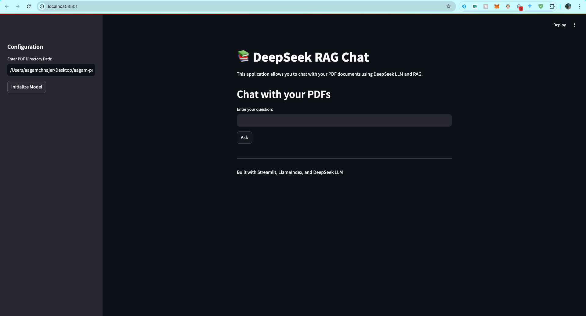
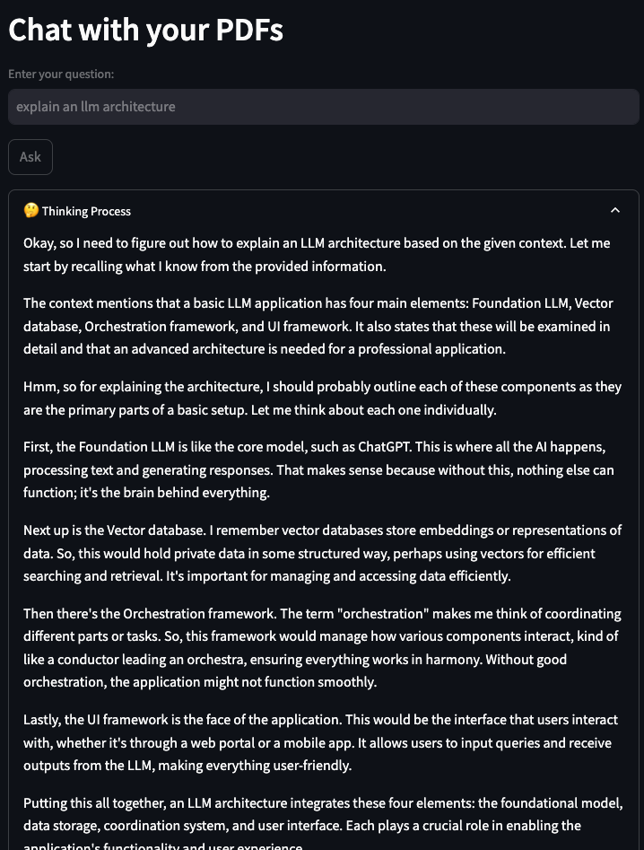
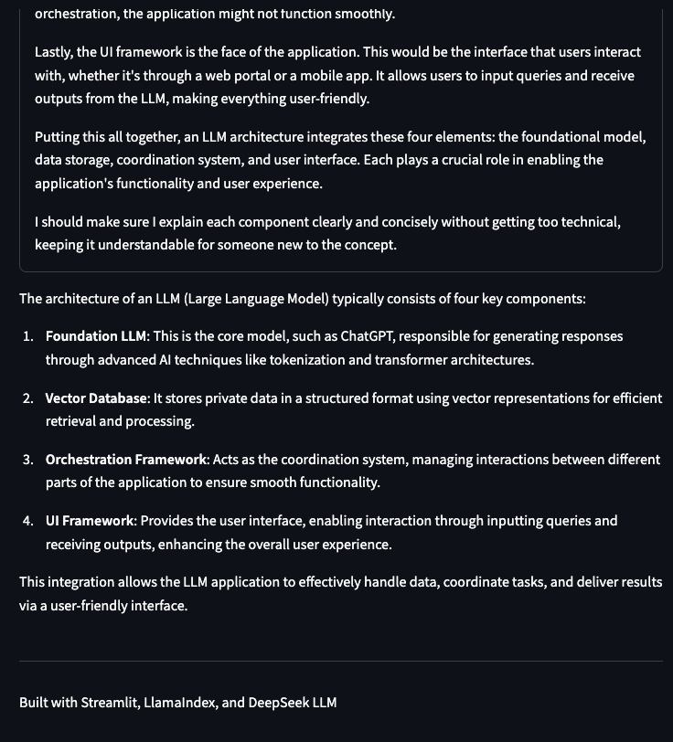

# DeepSeek RAG Chat 📚

A Streamlit-based application that enables users to have interactive conversations with their PDF documents using DeepSeek LLM and RAG (Retrieval-Augmented Generation) technology, featuring step-by-step reasoning.



## Features

- 📄 PDF Document Processing: Load and process multiple PDF files
- 🔍 Advanced RAG Implementation: Uses LlamaIndex for efficient document retrieval
- 🤖 DeepSeek LLM Integration: Powered by DeepSeek-r1 8B model
- 💪 High-Quality Embeddings: Uses BAAI/bge-large-en-v1.5 for document embeddings
- 🎯 Step-by-Step Reasoning: Shows detailed thinking process before providing answers
- 🔄 Real-time Streaming: Character-by-character response streaming
- 🖥️ User-Friendly Interface: Clean and intuitive Streamlit-based UI

## Sample Output

The application provides detailed responses with visible reasoning:

### Thinking Process


### Final Answer


The interface separates the model's thinking process from its final answer, providing transparency into its reasoning while maintaining clear and concise responses.

## Installation

1. Clone the repository:

```bash
git clone <repository-url>
cd deepseek-rag-chat
```

2. Install the dependencies:

```bash
pip install -r requirements.txt
```

3. Make sure you have Ollama installed and the DeepSeek model downloaded:

```bash
ollama pull deepseek-r1:8b
```

4. Run the application:

```bash
streamlit run app.py
```

## Configure the application:
- Enter the PDF directory path in the sidebar
- Click "Initialize Model" to load documents and set up the system
- Start asking questions about your PDFs
- Expand/collapse the thinking process section as needed

## Requirements

Key dependencies include:
- llama-index==0.12.12
- streamlit==1.41.1
- python-dotenv==1.0.1
- sentence-transformers==2.7.0
- torch>=2.1.2
- And more (see requirements.txt for full list)

## Project Structure

```bash
deepseek-rag-chat/
├── app.py              # Main Streamlit application
├── requirements.txt    # Project dependencies
├── assets/            # Screenshots and images
│   ├── home_page.png
│   ├── output_1.png   # Thinking process screenshot
│   ├── output_2.png   # Final answer screenshot
└── pdf_dir/           # Directory for PDF documents
```

## Features in Detail

- **Document Loading**: Supports recursive PDF loading from specified directories
- **Embedding Generation**: Uses BAAI/bge-large-en-v1.5 for high-quality document embeddings
- **Query Processing**: Custom prompt template for structured and detailed responses
- **Streaming Responses**: Character-by-character streaming for both thinking process and final answers
- **Interactive UI**: Collapsible thinking process section and clean answer display
- **Session Management**: Maintains conversation context using Streamlit session state
- **Error Handling**: Robust error handling for model initialization and query processing

## Contributing

Contributions are welcome! Please feel free to submit a Pull Request.

## License

[Add your license information here]

## Acknowledgments

- Built with [Streamlit](https://streamlit.io/)
- Powered by [LlamaIndex](https://www.llamaindex.ai/)
- Uses [DeepSeek LLM](https://github.com/deepseek-ai/DeepSeek-LLM)
